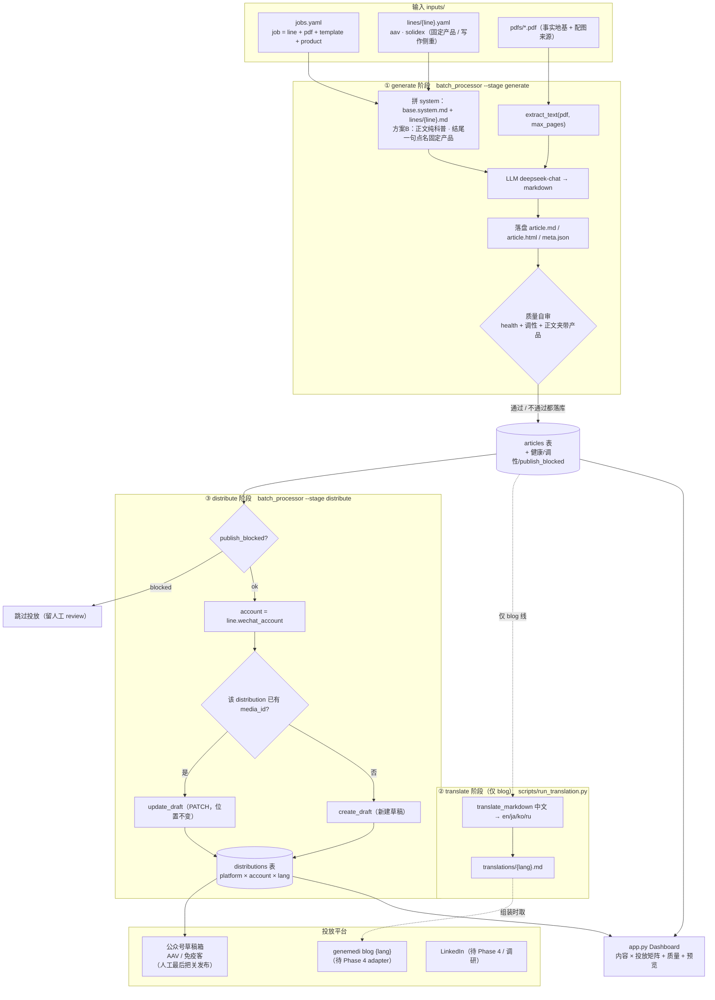
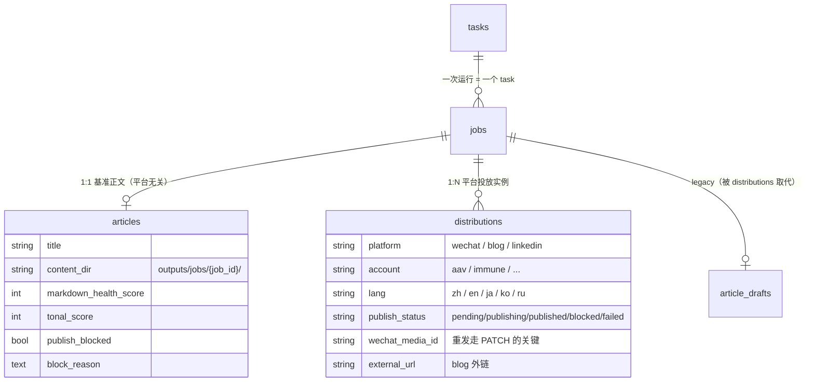

# 工作流程图：wechat-article

> 端到端流水线的全景。配套阅读 `docs/PROJECT.md`（架构与约定）、`docs/TODO.md`（路线图）。
>
> 核心心智模型：**内容与投放解耦**。内容生成一次（基准中文正文），按平台扇出投放；
> 公众号用中文原文，blog 按目标语翻译。

## 1. 三阶段总览



## 2. 数据模型（1 篇基准正文 → N 个平台投放）



> 翻译产物目前**落盘**在 `outputs/jobs/{job_id}/translations/{lang}.md`（暂无独立表；
> 待 Phase 4 blog distribute 落地时再决定是否入 `translations` 表）。

## 3. 关键决策点

| 决策点 | 规则 |
|---|---|
| **方案 B 产品植入** | 正文纯科普、零产品；只在结尾一段自然点名本线固定产品一次（人工选品，AI 只措辞） |
| **质量闸** | `health < 30`（损坏稿）/ `tonal < 60`（硬广腔）/ **正文夹带产品** → `publish_blocked`，落盘留人工、不投放 |
| **翻译触发** | **仅 blog 链路**：中文基准正文 → en/ja/ko/ru；**公众号链路用中文原文，不翻译** |
| **公众号重发** | 同 `(job, wechat, account, zh)` 已有 `media_id` → `draft/update`（PATCH，草稿位置不变）；否则 `draft/add` |
| **大 PDF** | `job.extra.max_pages` / env `PDF_MAX_PAGES` 截前 N 页，防爆上下文 |

## 4. CLI 速查

```bash
# 生成（方案B 出基准正文 + 质量自审），不投放
python batch_processor.py --stage generate

# 翻译（仅 blog 需要）：中文基准 → 目标语
python scripts/run_translation.py --job <job_id> --langs en,ja

# 投放到公众号草稿（被质量闸拦的会自动跳过）
python batch_processor.py --stage distribute

# 一条龙（生成 + 投放）；--dry-run 只生成不投放
python batch_processor.py            # = --stage all
python batch_processor.py --dry-run

# 看板
python app.py                        # http://127.0.0.1:5000
```

## 5. 模块地图

```
inputs/         jobs.yaml · lines/ · pdfs/ · style_templates/ · products/
prompts/        base.system.md（方案B 基底）· lines/{aav,solidex}.md · translation.system.md
data/           hard_ad_words.txt · translation_glossary.csv · do_not_translate.txt
core/main.py    ArticleAnalyzer（拼 prompt → LLM → markdown）
utils/          pdf_extractor · job_loader · line_loader · template_loader · product_loader
                health_check · tonal_qa · translator · wechat_html · wechat_client
db/database.py  tasks / jobs / articles / distributions（+ article_drafts legacy）
batch_processor.py  generate / distribute 两阶段编排
scripts/run_translation.py  翻译 CLI（blog）
app.py + templates/ + static/  服务端渲染看板（vanilla，无 React）
outputs/jobs/{job_id}/  article.md/.html · meta.json · translations/{lang}.md
```

## 6. 实现状态

| 阶段 | 状态 |
|---|---|
| P1' 内容层方案B（AAV + Solidex 双线） | ✅ 已做 + 真跑验证 |
| P2 数据解耦（article→distribution 1:N）+ generate/distribute 两段 | ✅ 已做 |
| P5 翻译（中文源 → en/ja/ko/ru，blog 专用） | ✅ 已做 + 真译验证 |
| P6 质量安全网（health + 调性 + 正文夹带产品 + 闸） | ✅ 已做 |
| P7 Dashboard（内容×投放矩阵 + 预览） | ✅ 已做 |
| **P3 产品模块** `line×platform`（图/外链/二维码组装） | ⏳ 待定（需先敲 schema） |
| **P4 多平台投放 adapter**（双公众号 token 隔离 / blog 接口 / LinkedIn） | ⏳ 待定 |

> P3/P4 待定中。当前 distribute 只接公众号单账户；blog/LinkedIn 投放 adapter 与
> 产品模块组装是接下来两块（参见 `docs/TODO.md`）。
```
